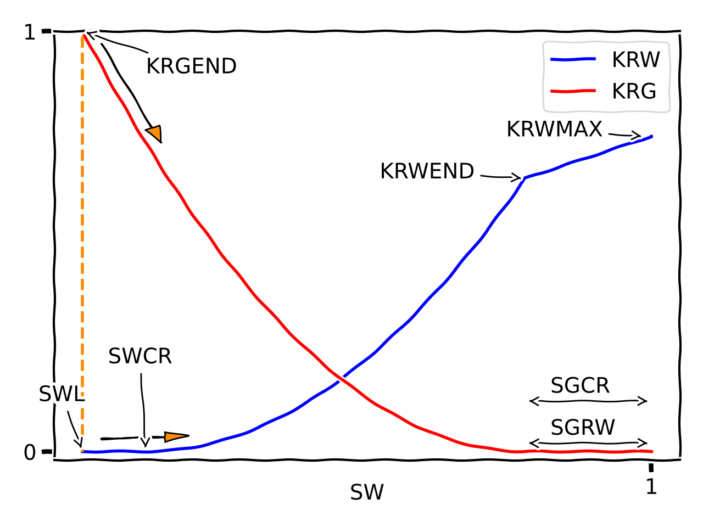
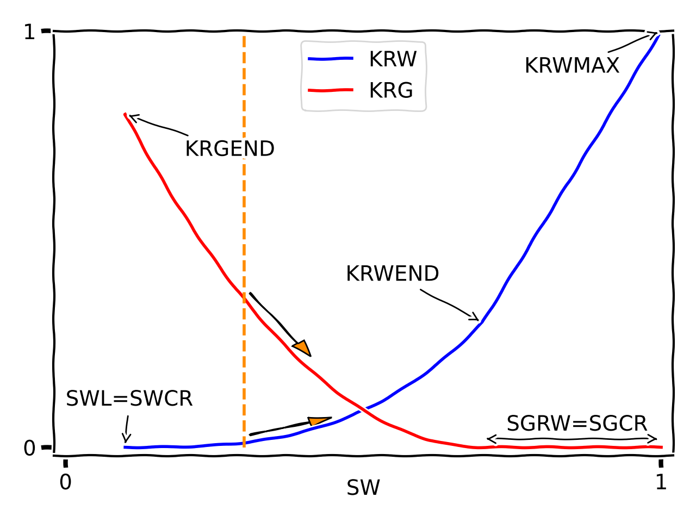

Modelling of flooding processes
===============================

This section illustrates how Pyscal is intended to be used in various
drainage/injection scenarios.

The notation ``WOGn`` for each case is a bookkeeping system for the flooding
processes. The positions in the letter triplet are fixed and reserved for
water, oil and gas. The letter used in each position states the
phase-saturation change, ``D`` for decreasing, ``I`` for increasing and ``C``
for constant. The trailing number is the cycle number.

In the figures below, the dashed orange line and the arrows indicate the
initial state for the relevant flooding process, and the saturation direction.

Water injection in oil field (IDC2)
-----------------------------------

.. list-table::
    :widths: 25 25 50
    :header-rows: 1

    * - Pyscal
      - Eclipse
      - Comment
    * - SWL
      - SWL
      -
    * - SWCR
      - SWCR
      - Critical water, often SWL + 0.01
    * - SORW
      - SOWCR
      - Residual oil
    * - KROEND
      - KRO
      - kro @ SWL
    * -
      - KRORW
      - Not used in Pyscal (kro @ SWCR)
    * - KRWEND
      - KRWR
      - krw @ SORW
    * - KRWMAX
      - KRW
      - Usually set to 1

Gas injection or solution gas drive (CDI2)
------------------------------------------

.. list-table::
    :widths: 25 25 50
    :header-rows: 1

    * - Pyscal
      - Eclipse
      - Comment
    * - SWL
      - SWL
      -
    * - SORG
      - SOGCR
      - Residual oil
    * - SGCR
      - SGCR
      - Critical gas
    * - KRGEND
      - KRGR
      - krg @ SORG
    * - KRGMAX
      - KRG
      - Usually 1
    * - KROEND
      - KRO
      -
    * -
      - KRORG
      - Not used in Pyscal
    * - krgendanchor=sorg
      -
      -
    * - SGRO=0
      -
      -

Dry gas field (invading water) (ICD2)
-------------------------------------

This scenario is for a two-phase Eclipse simulation. If condendsate
dropout can occur it should be modelled as a three-phase simulation.

.. list-table::
    :widths: 25 25 50
    :header-rows: 1

    * - Pyscal
      - Eclipse
      - Comment
    * - SWL
      - SWL
      - Initial state
    * - SWCR
      - SWCR
      - Critical water, when water becomes mobile. Usually set epsilon
        higher than SWL.
    * - SGRW
      - SGCR
      - Trapped gas/residual gas. SGCR must be set equal to SGRW
    * - KRGEND
      - KRG
      - Usually 1
    * -
      - KRGR
      - Not to be used.
    * - KRWEND
      - KRWR
      -
    * - KRWMAX
      - KRW
      -

Wet gas/condensate field, oil displacing gas (CID2)
---------------------------------------------------

.. list-table::
    :widths: 25 25 50
    :header-rows: 1

    * - Pyscal
      - Eclipse
      - Comment
    * - SORG
      - SOGCR
      - Critical oil
    * - SGCR
      - SGCR
      - Residual gas/trapped gas. Must equal SGRO
    * - SGRO
      -
      - Must equal SGCR
    * - KRGEND
      - KRG
      - Usually set to 1
    * - KRGMAX
      -
      - Not used. Leave defaulted at 1
    * - KROEND
      - KROR
      - Kro at trapped gas
    * - KROMAX
      - KRO
      -

.. |CO2| replace:: CO\ :sub:`2`\

|CO2|-injection (gas displacing water, DCI1)
--------------------------------------------

.. list-table::
    :widths: 25 25 50
    :header-rows: 1

    * - Pyscal
      - Eclipse
      - Comment
    * - SWL
      - SWL
      - Residual water ("SWR")
    * - SWCR
      - SWCR
      - Residual water. Set equal to SWL
    * - SGCR
      - SGCR
      - Critical gas.
    * - SGRW
      -
      - Set to 0
    * - KRGEND
      - KRG
      -
    * - KRWEND
      - KRW
      - Usually set to 1

|CO2| trapping (ICD2)
---------------------

Process is analoguous to "Dry gas field".

.. list-table::
    :widths: 25 25 50
    :header-rows: 1

    * - Pyscal
      - Eclipse
      - Comment
    * - SWL
      - SWL
      - Residual water ("SWR")
    * - SWCR
      - SWCR
      - Residual water. Set equal to SWL
    * - SGCR
      - SGCR
      - Trapped gas. Must equal SGRW
    * - SGRW
      - SGCR
      - Set to SGCR
    * - KRGEND
      - KRG
      -
    * - KRWEND
      - KRWR
      - Usually set to 1
